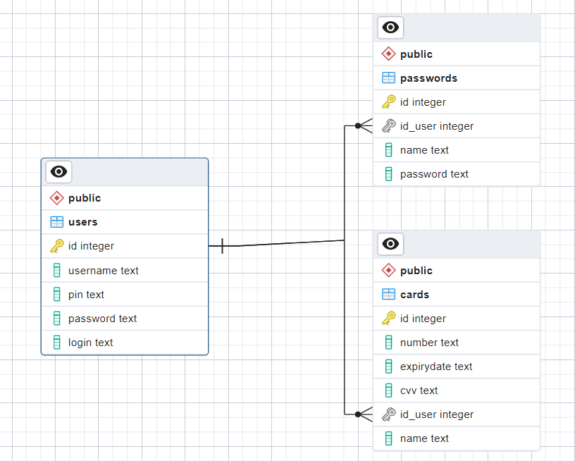

# Привет!
## Начнем с реализации сервера

Регистрация пользователей: Пользователи могут зарегистрироваться в системе, предоставив свои учетные данные, такие как логин, пароль и пин-код.

Аутентификация пользователей: Зарегистрированные пользователи могут войти в систему, предоставив свои учетные данные.

Управление картами: Пользователи могут добавлять новые карты, просматривать информацию о существующих картах.

Управление паролями: Пользователи могут добавлять новые пароли для различных сервисов или учетных записей, а также просматривать.

Логирование: Вся деятельность в системе логируется для обеспечения отслеживаемости и возможности анализа событий.

RESTful API: Программа предоставляет RESTful API для взаимодействия с другими приложениями или сервисами. В проекте это CLI-приложение

## Архитектура

Архитектура сервера была построенна по принципу чистой архитектуры, что позволило сделать код более понятным и расширяемым

Основные слои:

1. Слой хендлеров
2. Слой бизнес-логики
3. Слой хранилища

# Клиентское приложение
### Взаимодействие с сервером
Отправка запроса: Клиент формирует HTTP запрос с определенными параметрами и данными, которые требуется отправить на сервер. Например, при регистрации нового пользователя клиент может отправить запрос с данными пользователя на сервер.

Обработка запроса на сервере: Сервер принимает запрос, а затем обрабатывает его в соответствии с логикой приложения. На сервере могут выполняться различные действия, такие как проверка данных, сохранение информации в базе данных, выполнение операций и возврат результата.

Отправка ответа: После обработки запроса сервер формирует HTTP ответ и отправляет его обратно клиенту. В ответе могут содержаться данные, запрошенные клиентом, или информация о выполненной операции, или ошибка если такая возникла.

Обработка ответа на клиенте: Клиент принимает HTTP ответ от сервера и обрабатывает его в соответствии с логикой приложения. Например, если клиент отправил запрос на получение списка карт, то он может отобразить этот список на интерфейсе пользователя.

Обновление интерфейса: После получения и обработки ответа клиент может обновить интерфейс пользователя, отобразив новые данные или информацию о выполненной операции или подтвердить успешное сохранение.

# ER-диаграмма

